# 微服务架构的工程车辆管理系统

## 介绍

本项目是利用了微服务架构的思想，提出一种解决方案，解决了工程车辆监理的难题，以及附带的工程车辆管理。微服务是一种架构。顾名思义就是将一个项目拆分成多个小的服务，这样易于扩展也易于维护，只要把负载均衡的问题解决好了，性能就不是大问题。所以我才会在服务端选择使用Nginx高性能服务器。只是我这种解决方案弊端会比较多，但是会比较适合熟悉SpringBoot并且比较小一点项目。后面会升级到SpringCloud也不一定。SpringCloud是一种比较好的微服务解决方案，生态也很完备，并且提供了较好的负载均衡、服务容灾、注册中心等组件。

### 解决问题

### 在线演示

1、项目地址：https://car2.blctek.com:8443/

2、账号密码：ghost/ghost123

## 技术栈

本项目是前后端分离项目，需要用到前端、中端（服务器）、后端需要用到的技术栈。

### 前端

- npm：NPM的全称是Node Package Manager，是一个NodeJS包管理和分发工具，已经成为了非官方的发布Node模块（包）的标准。主要用来下载相关依赖包。
- [Vue.js](https://cn.vuejs.org/index.html)：Vue (读音 /vjuː/，类似于 view) 是一套用于构建[用户界面](https://baike.baidu.com/item/用户界面/6582461)的渐进式[JavaScript](https://baike.baidu.com/item/JavaScript/321142)框架。该项目的所有前端代码都由他构建，所以你必须掌握，并且很熟悉。本项目是基于Vue.js2.x
- [vue-router](https://router.vuejs.org/zh/)：vue官方提供的路由管理器，该项目的所有前端路由都由他控制，你必须掌握，并且熟悉。
- [vuex](https://vuex.vuejs.org/zh/)：vue官方提供的全局状态管理，该项目的全局状态管理由他提供，也必须掌握。
- [vue-cli](https://cli.vuejs.org/zh/)：vue官方提供的vue项目构建脚手架，能够让你够快的构建vue项目，简化了太多webpack的配置，你需要了解。本项目是利用vue-cli3.x构建。
- [axios](http://www.axios-js.com/zh-cn/)：一个基于 promise 的 HTTP 库，可以用在浏览器和 node.js 中。比ajax更加强大且高效且能够高度定制化，可以将它看作对ajax的进一步封装。该项目的所有HTTP请求均有他构建，所以你必须掌握。
- [element-ui](https://element.eleme.cn/#/zh-CN)：一套为开发者、设计师和产品经理准备的基于 Vue 2.0 的桌面端组件库。本项目的所有组件都有他构建，所以你必须掌握且熟悉。
- [vue-element-admin](https://panjiachen.gitee.io/vue-element-admin-site/zh/guide/)：是一个后台前端解决方案，它基于 [vue](https://github.com/vuejs/vue) 和 [element-ui](https://github.com/ElemeFE/element)实现。它使用了最新的前端技术栈，内置了 i18 国际化解决方案，动态路由，权限验证，提炼了典型的业务模型，提供了丰富的功能组件，它可以帮助你快速搭建企业级中后台产品原型。本项目的后台管理部分是基于它的模板vue-admin-template构建，你起码得需要掌握并且熟悉vue-admin-template
- [vue-amap](https://elemefe.github.io/vue-amap/#/)：基于 Vue 2.x 与高德的地图组件，本项目的路径显示部分由他构建，vue-amap比较简单，了解即可。
- [echarts](https://echarts.apache.org/zh/index.html)：一个基于 JavaScript 的开源可视化图表库，随用随看，了解即可。

### 服务器

- Nginx：一个高性能服务器，主要解决服务器上的微服务之间的负载均衡问题，以及反向代理微服务。

### 后端

- Maven：Springboot的所有依赖管理由它完成。

- SpringBoot：本项目后端基于SpringBoot-web实现，所以你必须掌握，并且很熟练。
- MyBatis：本项目的后端的数据的持久层由它完成，所以必须掌握，并且很熟练。
- MySQL：构建数据库。
- JWT：JSON Web Token。主要用来解决微服务之间的令牌共享。主要用于创建和验证token。
- aop：本项目后端日志部分由Spring-aop面向切面编程完成。

## 环境部署

### npm

```bash
npm -v # >=6.14.8
```

#### 1、移动到xxx-web下

```bash
cd xxx-web
```

#### 2、安装依赖包

```bash
npm i  # npm install
```

#### 3、运行开发模式

```bash
npm run dev
```

#### 4、运行生产模式

```bash
npm run build:prod
```

### maven

maven v3.5.0

### Java

JDK1.8

## 项目介绍

本项目的前端都是基于Vue.js、后端都是基于SpringBoot，服务端采用的是Nginx高性能服务器。

### 项目架构

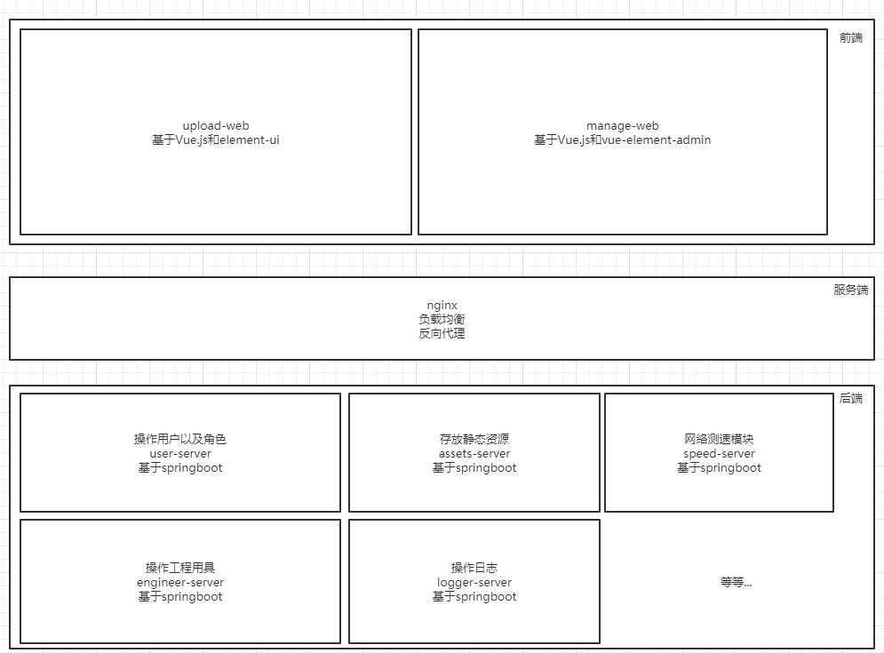

采用微服务的好处就是易于扩展，前后端不会太耦合。

## 版本控制

版本控制采用的是git。

有两条分支（branch）：dev（开发分支）、master（主分支）

标签版本（tag）：每发布一个版本或者有重大更新就会打上tag

## 环境变量

开发的时候肯定会遇到本地开发环境（以下简称dev）和服务器线上生产环境（以下简称prod）等，几套数据库，几套接口地址，如果每一次都需要修改对应的数据库的连接地址或者接口地址，我相信这肯定会是一场灾难。所以你需要保证你的dev和prod的环境起码是一样的（或者差别不要太大），比如prod上起码得有MySQL数据库、Nginx服务器、JRE（Java运行环境），其实OpenJDK也行，运行时占用的内存比较小，但是性能可能就会差些。你本地dev就也必须得有上述东西才行。

### 前端

采用.env.production和.env.development文件来配置对应的接口地址的，具体可以参看：[vue-element-admin的环境变量](https://panjiachen.gitee.io/vue-element-admin-site/zh/guide/essentials/env.html#%E7%8E%AF%E5%A2%83%E5%8F%98%E9%87%8F)

比如我的dev环境需要的接口地址：

```properties
# 开发环境
# just a flag
ENV = 'development'
# base url
VUE_APP_BASE_URL = 'http://localhost:8080/'
```

具体到时候在引用的时候就采用`process.env.VUE_APP_BASE_URL`来获取：

```js
//axios实例
const axiosInstance = axios.create({
  baseURL: process.env.VUE_APP_BASE_URL, // url = base url + request url
  // withCredentials: true, // send cookies when cross-domain requests
  timeout: 5000 // request timeout
})
```

记住：`process.env.VUE_APP_BASE_URL`和`process.env['VUE_APP_BASE_URL']`是等价的。那么接下来每次运行的时候就会根据你配置的环境变量来自动获取VUE_APP_BASE_URL了。这点简直不要太方便。

### 后端

后端主要就是采用SpringBoot的application.yaml配置文件的方式来实现：

```
application.yaml				#公共配置文件（同时会表明要启用哪个配置文件）
application-dev.yaml			#开发环境配置文件
application-prod.yaml			#生产环境配置文件
```

#### application.yaml：

```yaml
#当前启用哪个配置文件
spring:
  profiles:
    active: dev
#项目名称
  application:
    name: user-server
#数据源
  datasource:
    type: com.alibaba.druid.pool.DruidDataSource
    druid:
      stat-view-servlet:
        enabled: true
        login-username: mysql
        login-password: mysql
#端口号
server:
  port: 8097
#mybatis相关
mybatis:
  mapper-locations: classpath*:mybatis/mapper/*Mapper.xml
```

这里配置了全局配置文件，同时在spring.profiles.active里根据名字启用对应的配置文件

#### application-dev.yaml：

```yaml
#当前配置文件名称
spring:
  config:
    activate:
      on-profile: dev

  datasource:
    driver-class-name: com.mysql.jdbc.Driver
    url: jdbc:mysql://localhost:3306/xxx?useUnicode=true&characterEncoding=utf8&zeroDateTimeBehavior=convertToNull&useSSL=true&serverTimezone=GMT%2B8
    username: root
    password:

```

#### application.prod.yaml：

```yaml
spring:
  config:
    activate:
      on-profile: prod
  datasource:
    driver-class-name: com.mysql.jdbc.Driver
    url: jdbc:mysql://xxx.xx.xx.xx:3306/xxx?useUnicode=true&characterEncoding=utf8&zeroDateTimeBehavior=convertToNull&useSSL=true&serverTimezone=GMT%2B8
    username: root
    password: root
```

局部配置如果有同名属性会覆盖全局配置，类似局部变量和全局变量。

## 服务端部署

服务端部署采用的Nginx，所以只需要修改Nginx的配置文件就行。最好是一个前端就当作是一个项目，然后再根据对应的端口号代理对应的后端：

```nginx
	# localhost:8081上传车辆信息
	server	{
		listen 8081;
		server_name localhost;
		location / {
			root E:/project/upload-web/dist/;
			index index.html;
            try_files $uri $uri/ /index.html;
		}
		#静态资源服务器（用于上传图片）
		location /assets-server/ {
			client_max_body_size  15M;
			proxy_pass	http://localhost:8095/;
		}
		#工程用具信息服务器（用户上传车辆信息和获取类型数据）
		location /engine-server/ {
			proxy_pass http://localhost:8096/;
		}
	}
```

前端的location就直接绝对定位到对应的项目`dist/`下，后端就直接根据端口号代理即可。

> **注意**
>
> Nginx的代理是需要在`proxy_pass http://localhost:8095/`后面这个地址的最后加上`/`，这样就是代理。如果`proxy_pass	http://localhost:8095`没有加上`/`，就是转发。
>
> **区别**
>
> 比如我从浏览器客户端发起了一个`localhost:8095/assets-server/image/test.jpg`的请求：
>
> 如果是代理的话，Nginx会先匹配到`location /assets-server/`然后就会直接将`/assets-server/`用这个`localhost:8095`的服务（以Jar包形式启动的SpringBoot项目）替代，即用户实际上会访问的是`localhost:8095`这个服务，或者说是`8095`端口下的`/`服务。
>
> 如果是转发，Nginx同样会匹配到`location /assets-server/`然后直接将`8095`这个端口号下的`/assets-server/`服务转发给用户，即用户实际上访问到的会是`8095`端口下的`/assets-server/`服务。

## <span id="auth">权限验证</span>

### 后端

#### JWT

关于JWT可以参看：[JWT认证原理，并整合SpringBoot](https://blog.csdn.net/weixin_45747080/article/details/111684442)

利用JWT来贯穿全后端，然后利用每个SpringBoot-web的HandlerInterceptor（拦截器），在拦截器中验证是否存在token，并且验证token的有效性、token中存的用户的角色等来判断是否允许请求，并且返回相应的response。同时在WebMvcConfigurer里注册该拦截器，并且配置好哪些请求需要拦截，哪些请求不需要拦截。

```java
@Component
public class CrudInterceptor implements HandlerInterceptor {
    @Override
    public boolean preHandle(HttpServletRequest request,
                             HttpServletResponse response,
                             Object handler) throws Exception {
        String token = request.getHeader("X-Token");//从header中获取token
        // 对token进行相应判断
        if (true) {
            return true; //放行
        } else {
            return false; //不放行
        }
    }
}
```

```java
@Configuration
public class WebConfig implements WebMvcConfigurer {
    @Autowired
    private CrudInterceptor crudInterceptor;
    @Override
    public void addInterceptors(InterceptorRegistry registry) {
        List<String> pathList = new ArrayList<>();          //要拦截的请求集合
        pathList.add("/role/**");                       //要拦截/role/下的所有请求
        pathList.add("/user/**");                         //要拦截/user/下的所有请求
        List<String> excludePathList = new ArrayList<>();   //不过滤的请求集合
        excludePathList.add("/role/select*");           //不过滤/role/下的查询的请求
        excludePathList.add("/user/select*");             //不过滤/user/下的所有查询的请求
        registry.addInterceptor(crudInterceptor)
                .addPathPatterns(pathList)
                .excludePathPatterns(excludePathList);
    }
}
```

PathPatterns是配置哪些来自浏览器的请求需要被拦截，ExcludePathPatterns则是不需要被拦截。（我一般会拦截除了查询的请求）。

所以后端的权限验证逻辑就是，在用户登录成功的时候会向用户下发一个token（token中包含用户的角色，JWT特性）。然后每一次发起请求时如果被拦截，就会进行对token进行相应的判断（比如该角色是否拥有该操作的权限），然后放行或者不放行。所以token就是令牌，就是通行证，每一次的发起请求都会根据你携带的token进行验证身份。

### 前端

主要采用cookies和vuex和vue-router结合使用的方式来达到存储用户token，验证用户token，限制用户访问和操作

#### cookies

`@/utils/auth.js`（token在cookies中的存取）：

```js
import Cookies from 'js-cookie'

const TokenKey = 'vue_admin_template_token'

//从cookies里获得key为'vue_admin_template_token'的token
export function getToken() {
  return Cookies.get(TokenKey)
}

//将key为vue_admin_template_token的token放入cookies中（设置cookies过期时间（number类型））
export function setToken(token,expires=7) {
  return Cookies.set(TokenKey, token, { expires })
}

//将cookies中key为vue_admin_template_token的token移除
export function removeToken() {
  return Cookies.remove(TokenKey)
}

```

#### vuex

`@/store/modules/user.js`（将token赋值给vuex）

```js

import { getToken, setToken, removeToken } from '@/utils/auth'
import router , { resetRouter } from '@/router/index'

//默认的state
const getDefaultState = () => {
  return {
    token: getToken(), //token（存在cookies中）
    id: undefined,
    roles: [],
  }
}

const state = getDefaultState()

//同步方法
const mutations = {
  // 重置STATE
  RESET_STATE: (state) => {
    Object.assign(state, getDefaultState())
  },
  // 设置id
  SET_ID: (state, id) => {
    state.id = id
  },
  // 设置角色
  SET_ROLES: (state, roles) => {
    state.roles = roles
  },
  // 设置token
  SET_TOKEN: (state, token) => {
    state.token = token
  }
}

//异步方法
const actions = {
  // 用户登录
  login({ commit }, loginInfo) {
    //登录成功后获得token、用户的相关信息roles（角色）
    //将token存入cookies
  },

  getInfo({ commit, state } ){
      
  },

  // 用户退出
  logout({ commit, state }) {
    //退出时清空cookies中的token并且将state还原
  },
}

export default {
  namespaced: true,
  state,
  mutations,
  actions
}

```

由于vuex的特性，vuex的全局变量是存储在内存中的，浏览器刷新了以后就没有了，所以如果想要vuex全局变量能够持久化就可以考虑使用localStorage或者sessionStorage存储到本地，而该项目使用的是每一次请求路由（刷新页面也会重新请求路由）的时候使用`getInfo()`方法利用token向服务端请求一次用户个人信息，从而每次都会获得用户的个人信息，如id、roles。这样就不会每次都从客户端本地取，而是从服务端中取。

无论哪种方式都是可行的，你只需要注意的就是vuex的全局变量是存储在内存中的，刷新就没有了，你需要在客户端持久化。在用户登录的时候就将用户个人信息，如id、roles赋值给vuex和本地存储，并且将token存入cookies。用户退出时必须要先清空cookies中的token和客户端本地的个人信息，最后再将state利用`getDefaultState()`还原。因为`getDefaultState()`里是取的cookies和本地存储的个人信息，每次在用户进入在项目的时候都会赋值（直接从cookies和本地取值），如果你没有先清空cookies和本地存储就进行还原state，那么这次用户即使退出，但是vuex里存储的仍然有cookies中的token和本地存储的个人信息。具体可以参看vue-admin-template的store中user用户信息的设计[@/store/mudules/user.js](https://github.com/PanJiaChen/vue-admin-template/blob/master/src/store/modules/user.js)，写得特别好。

#### vue-router

另外还通过路由来控制用户哪些页面能访问哪些页面不能访问：在访问路由前通过路由守卫获得要访问的页面的权限（哪些角色能够访问），再通过vuex中存储的用户的角色进行比对，如果匹配则允许访问，否则不允许访问。关于如果利用vue-router来控制用户能够访问的页面，vue-element-admin的作者PanJiaChen的这篇文章讲得特别好 [手摸手，带你用 vue 撸后台 系列二(登录权限篇)](https://juejin.im/post/591aa14f570c35006961acac)。

#### v-permission

通过你还可以通过指令来达到按钮级别的权限控制：控制该操作该用户是否能够执行，具体可以参看：[vue-admin-element的权限验证](https://panjiachen.gitee.io/vue-element-admin-site/zh/guide/essentials/permission.html)

## 密码加密

用户登录的用户名和密码验证以及存储是一个老生常谈的问题，你需要考虑以下问题：

1. 密码在http请求中不能明文传输。
2. 密码在数据库中存储时开发者不能知道。

本项目采用的方式是：用户不能自行注册，只能管理员新增用户，管理员新增用户的时候会给用户生成一个只属于该用户的**salt（盐）**，并且该盐存在另外一个表内，同时该盐与用户的用户名按照一定规则再经过md5加密算法生成一个默认的密码。所以用户默认密码是随机盐+用户名+规则。所以这就解决了第二个问题，用户的密码开发者是完全不知道的。同时在浏览器客户端，用户在请求登录的时候会先根据用户名获得该用户名的salt，如果salt存在说明存在该用户，此时用户输入密码后，再根据密码+盐+规则的方式混淆该密码，然后通过post的方式提交给后端，后端直接将用户名和密码进行验证，所以此时就解决了第一个问题，密码在http请求中是密文传输。

需要注意的是，前后端的密码混淆规则应该一致才行。

- 为什么要用md5算法？因为md5是不可逆的。
- 为什么要使用随机salt？避免撞库。

## <span id='resources'>静态资源</span>

利用SpringBoot-web启动了一个只存放静态资源的服务。

### 文件上传

比如我需要上传图片或者文件，只需要利用MultipartFile类接收文件，然后存储到服务器本地就可以了。

### 文件下载（访问）

文件下载到服务器本地了没有用，还得需要利用该服务打开本地资源映射才行。

配置WebMvcConfigurer：

```java
@Configuration
public class AssetsConfigurer implements WebMvcConfigurer {
    @Override
    public void addResourceHandlers(ResourceHandlerRegistry registry) {
        //获取文件的真实路径
        String winPath = System.getProperty("user.dir")+"\\assets-server";
        String linuxPath = System.getProperty("user.dir")+"/assets-server";
        //获取操作系统的名字
        String os = System.getProperty("os.name");
        if (os.toLowerCase().startsWith("win")) {//windows系统
            registry.addResourceHandler("/image/**","/zip/**")
                .addResourceLocations("file:"+winPath+"/image/","file:"+winPath+"/zip/");
        }else{//linux和mac系统 可以根据逻辑再做处理
            /*handlers表示会拦截的请求，比如会处理/image*//**这种样式URL的请求
            locations表示会映射到的本地路径
            将resourceHandler拦截到的URL请求映射到resourceLocations上的本地路径
             比如以下语句就会拦截/image/**和/zip/**的url请求，然后映射到服务器本地的
             /image/或/zip/文件路径下 */
            registry.addResourceHandler("/image/**", "/zip/**")
                .addResourceLocations("file:"+linuxPath+"/image/","file:"+linuxPath+"/zip/");
        }

    }
}
```

主要的逻辑就是拦截对应的请求，然后将该对应的请求映射到服务器上的本地目录，这样就可以达到访问（下载）的目的了。就相当于将本地目录映射到某某请求上，那么浏览器客户端在访问该请求的时候就会自动映射到该文件上，这样就可以下载或者浏览了。

## 工程用具上传

手机扫描二维码或者访问http://upload.wqkd.blctek.com/+deviceId，需要注意的是，需要在`/`后面加上设备编号，然后就会直接重定向到填写工程用具信息页面，自动将URL中`/`后面的设备编号填入表单中：

.JPEG)

需要注意的是，工程用具信息以及上传图片大小都会有验证，必须正确如实的输入。同时图片上传成功后会返回该图片的uuid作为该图片的唯一识别码，然后绑定到工程用具的信息中，这也访问该工程用具就能访问到该uuid，从而访问到该图片。

关于页面重定向：

使用vue-router实现的，利用vue-router的动态参数，获取URL上的参数。

`@/router/index.js`

```js
let routes=[
  {
    path: '/:deviceId',
    redirect: '/vehicle/:deviceId' 					//默认会重定向到Vehicle页面并且携带参数
  },
  {
    name: 'Vehicle',
    path: '/vehicle/:deviceId',
    component: () => import('../views/upload/vehicle')	//携带参数
  },
  {
    name: 'Machine',
    path: '/machine/:deviceId',
    component: () => import('../views/upload/machine')	//携带参数
  }
];
```

然后通过`this.$route.params.deviceId`来获得URL上的参数

## 工程监理

该项目的核心功能，通过定位来达到对工程用具进行监理的目的。获取来自硬件后端的GPS坐标中的经纬度来进行在地图上定位（以及一些GPS常用的其他信息，比如风速、海拔、时间）。`vue-amap`将高德地图JS API进行了封装，能够快速绘制折线和图标以及一些常用的插件，比如：比例尺、鹰眼、卫星图等。

### 效果图

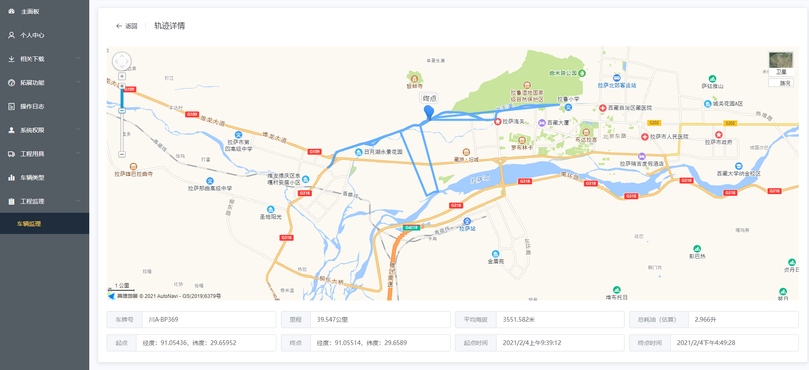

### 原理

GPS定位通常返回的是当前瞬时时间下当前位置的经度、纬度、高度、海拔等信息。两点就会连成一条直线，n点依次连接就会形成折线，然后再绘制出起点和终点。

#### GPS坐标点数据

```json
{
    "data": [
        {
            "vehicle_num": "川ABP369",
            "record_time": "2021-02-04T09:39:12.000+0800",
            "latitude": 29.66222,
            "longitude": 91.0528,
            "latitude_amap": 29.65952,
            "longitude_amap": 91.05436,
            "altitude": 3612.7,
            "pdop": 3.3,
            "hdop": 1.8,
            "vdop": 2.8,
            "cogt": 0,
            "sogknot": 0,
            "sogkph": 0
        },
        {
            "vehicle_num": "川ABP369",
            "record_time": "2021-02-04T09:39:52.000+0800",
            "latitude": 29.66223,
            "longitude": 91.05278,
            "latitude_amap": 29.65953,
            "longitude_amap": 91.05434,
            "altitude": 3612.2,
            "pdop": 3.1,
            "hdop": 1.7,
            "vdop": 2.6,
            "cogt": 0,
            "sogknot": 0,
            "sogkph": 0
        },
        ...
}
```

都是类似这样的坐标点数组，然后再将这些的形成坐标数组传入给`vue-amap`绑定到polyline上就能绘制出来了：

```vue
<el-amap-polyline
          :path="path"
          :lineJoin="'round'"
          strokeColor="#409EFF"
          strokeOpacity="0.8"
          strokeWeight="5"
          strokeStyle= "solid"
        /><!--轨迹折线-->
<el-amap-marker
          vid="startMarker"
          :position="startMarker.position"
          title="起点"
        /><!--起点标记-->
<el-amap-marker
          vid="endMarker"
          :position="endMarker.position"
          title="终点"
        /><!--终点标记-->
```

逻辑就是通过网络请求得到一整条坐标点对象数组，然后将该坐标点对象的经纬度赋值给path（因为高德地图折线所需要的数组只有经纬度），然后再将path绑定到`el-amap-polyline`上就可以了，同理可得坐标点对象的时间数组、海拔数组等，然后即可计算出平均海拔、起点坐标和终点坐标。

### 总结

GPS定位仪器放置在车辆上，设置一定时间间隔获取来自GPS的信号，GPS会返回此时该点的经纬度、海拔、时间等信息，将信息上传到服务器中，然后前端利用http请求获得某一辆车、某个时间段的坐标点对象数组，然后遍历该数组，存放成高德地图适用的格式（高德地图适用的格式）。

### 文档

[高德地图JS API](https://lbs.amap.com/api/javascript-api/guide/overlays/vector-overlay#polyline)：高德地图原生官方JS API。

[vue-amap](https://elemefe.github.io/vue-amap/#/)：基于Vue.js和高德原生JS 封装。

## 工程用具

方便对录入该系统的工程用具进行信息上的管理，比如：车辆归属、车牌、驾驶员等相关信息。

### 效果图

#### 展示

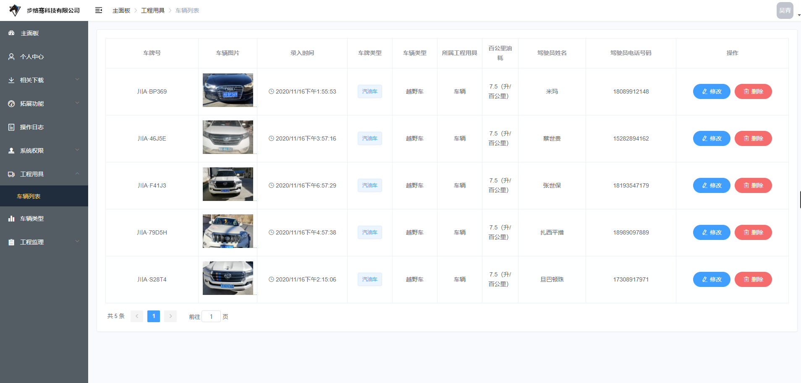

直接通过http请求获得工程用具对象数组，然后遍历数组，得到对应的信息，其中图片需要注意的是：直接利用该工程用具uuid然后访问到静态资源服务上的该图片就能访问了。

#### 修改

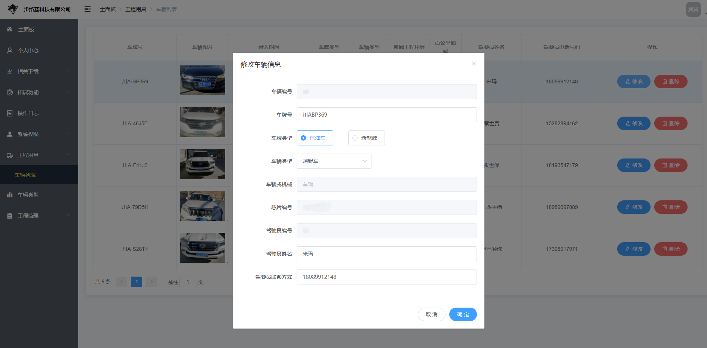

## 工程用具类型

方便自定义工程用具的类型，比如车辆会有越野车、公路车、洒水车等等类型，方便自定义修改删除增加

### 效果图

#### 展示

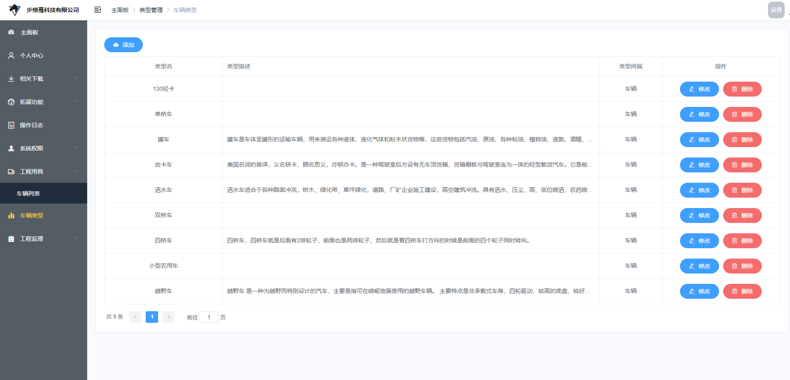

#### 新增

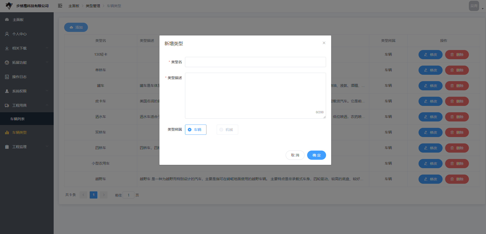

#### 修改

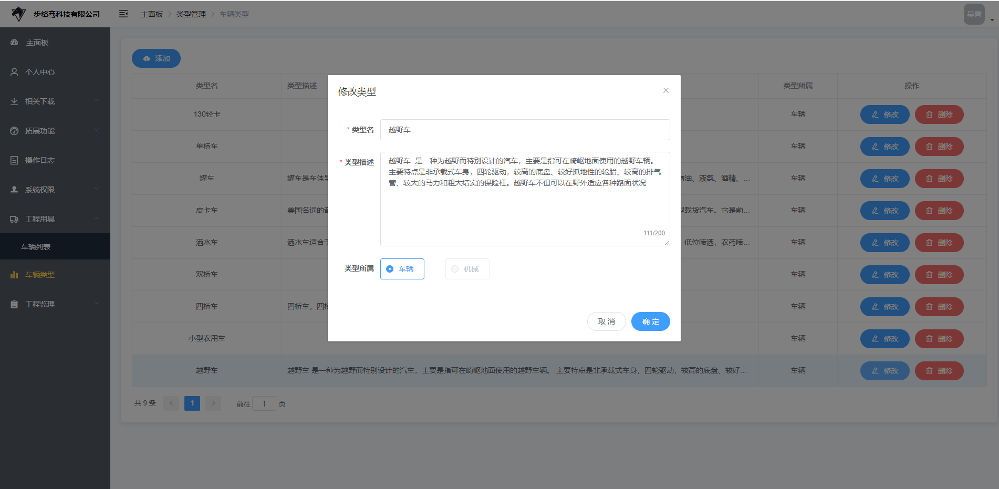

因为工程用具的类型是直接绑定的类型编号，所以即使类型修改后，工程用具的类型也会跟着修改。同时在扫码录入工程用具信息的时候也会随之更新。

## 系统权限

本项目权限划分主要用角色和用户来划分。

### 角色

角色类似于用户组的概念，就是某个角色能够访问哪些页面，某个角色能够进行哪些操作。目前角色只细分到了用户能够进行具体哪一个操作上（比如：增删改用户），同时还能够新增角色（v1.6）。目前暂不支持新增角色后然后给角色指定哪些页面能够访问哪些操作能够进行。

#### 效果图

##### 展示

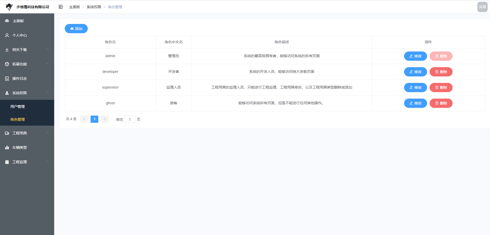

##### 修改

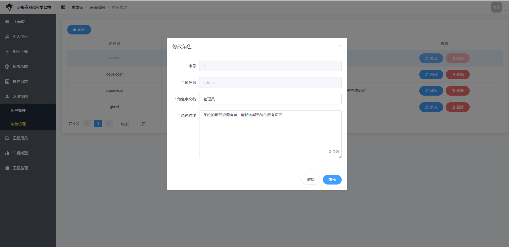

##### 新增

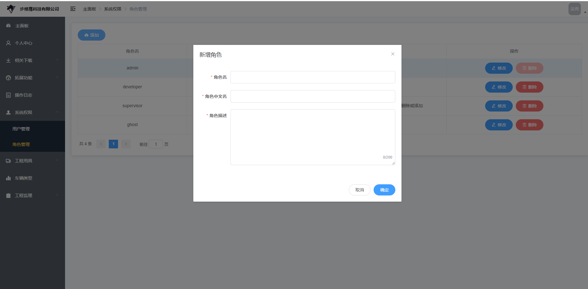

### 用户

用户就是能够登录系统的最小单元。通过指定给用户分配角色来指定用户能够访问什么页面，进行什么操作。同时在前面的<a href="#auth">权限验证</a>有讲过我是怎样做到前后端互相联调实现权限验证的。

#### 效果图

##### 展示

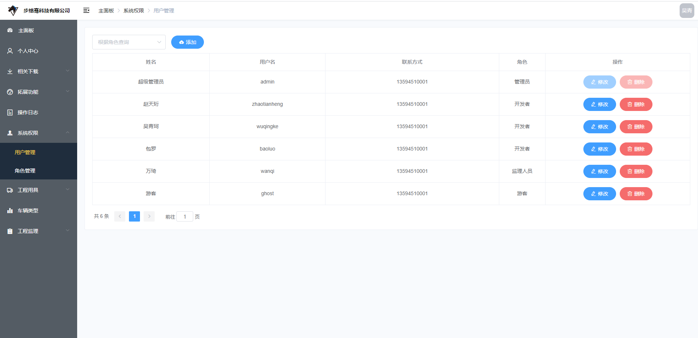

##### 条件查询

同时还可以按角色直接快速查询用户

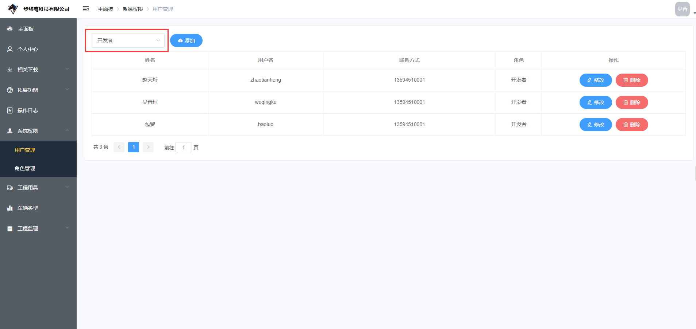

##### 修改

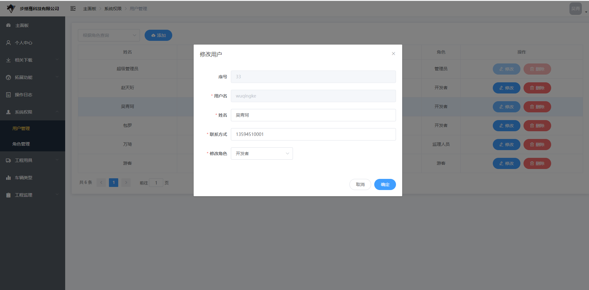

##### 新增

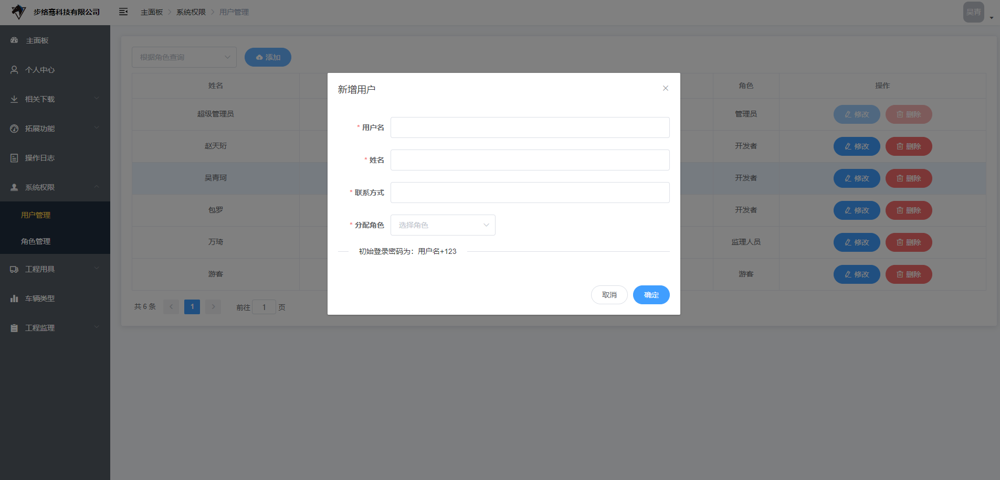

## 日志管理

由SpringBoot-AOP实现，细分到controller上的方法，获得该方法的切面（只为增删改定义了切点），同时采用注解的方式给方法定义切点：方法上有注解的才会执行aop。同时在该切面的正常返回通知里来判断该方法是否执行成功、执行者、执行的客户端来源、执行者的IP地址、执行该操作的时间等。关于SpringBoot-AOP的切点、切面以及返回通知的解释请参看：

### 效果图

#### 展示

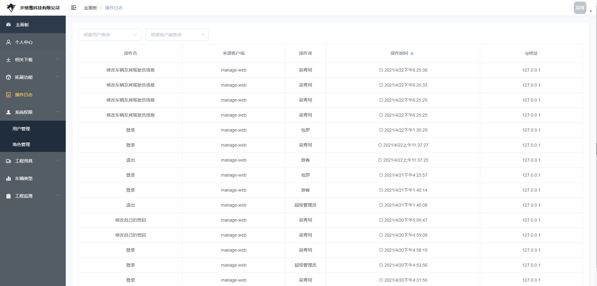

#### 条件查询

同时能够利用执行者或者来源客户端进行快速查询日志

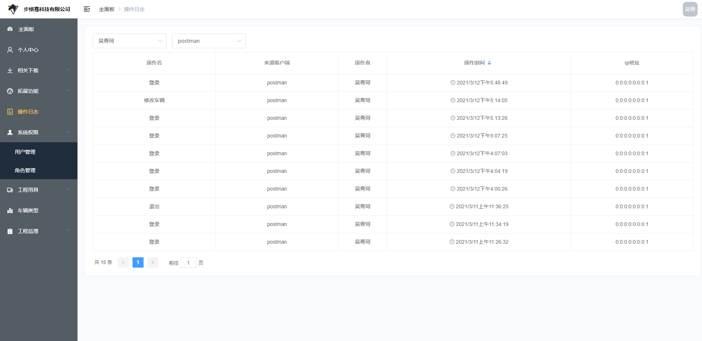

> **提示**
>
> 估计是Nginx正向代理的问题，直接将用户访问的真实IP经过正向代理后然后再经过反向代理到具体日志微服务中的时候直接将Nginx服务器的本机地址代理到服务当中去了。下个版本预计修复。
>
> **解决方案**
>
> 不用Nginx反向代理，使用Nginx直接转发到服务。

### 注解

定义注解，用于定义切点表明加了该注解的就是切面

```java
@Target(ElementType.METHOD)
@Retention(RetentionPolicy.RUNTIME)
@Documented
public @interface CrudLog {
    String value() default "";
}
```

### AOP

关于SpringBoot的AOP可以参看：[一张图搞懂SpringBoot AOP的5个通知的交织顺序](https://blog.csdn.net/weixin_45747080/article/details/114421918)，[Spring的AOP面向切面编程](https://blog.csdn.net/weixin_45747080/article/details/106364788)

#### 使用方法

在需要进行日志AOP的直接加上注解：`@CrudLog`

```java
@CrudLog("新增用户")
@PostMapping("/insertUser")
public ResultResponse insertUser(@RequestBody VoUser voUser){
    //对获取到的参数进行处理
    return new ResulteResponse()
        ,setData(true)
        .setMessage('')
        .setCode(2000)
}
```

加上了该注解的方法就能够直接作为切面，从而转交给AOP。

#### 具体逻辑

1、定义切点为`@CrudLog`注解：加上该注解的就是切面

2、在正常返回通知中获得如下参数：（注：正常返回通知是方法正常执行没有异常时才会进行）

- 操作名：该切点的注解值
- 操作时间：当前时间（`new Date()`）
- 执行者：从request的header中获得自定义的X-Token，利用JWT解开这个token获得其中的用户姓名
- 执行者IP：从servlet的http处理器中获得request，然后从request中获得IP
- 执行者客户端：从request的header中获得自定义的X-Client

```java
@Component
@Slf4j
@Aspect
public class CrudAspect {
    @Autowired
    private LoggerService loggerService;

    /**
     * 定义切点为：CrudLog这个注释
     */
    @Pointcut("@annotation(com.blctek.userserver.anno.CrudLog)")
    public void crudPointCut() { }//切入点签名


    /**
     * 正常返回通知（方法有正常返回值时）：（一般用这个）
     * 在整个后置通知前，在整个前置通知后，与异常返回并列。
     * 将返回值强转为ResultResponse，获得其中的data，如果data为true则证明操作成功，
     * 再从切点里获得注解名称（也就是操作名），从handler中获得request再从request中获得ip，
     * 再从header中根据X-Client和X-Token获得客户端名称和token，再从token中获得name（executor操作者）
     *
     * @param joinPoint   切点
     * @param returnValue 正常返回值
     */
    @AfterReturning(pointcut = "crudPointCut()", returning = "returnValue")
    public void crudAfterReturning(JoinPoint joinPoint, Object returnValue) {
        ResultResponse resultResponse = (ResultResponse) returnValue; //将返回值强转为ResultResponse
        Boolean data = (Boolean)resultResponse.getData();             //获取ResultResponse里的data
        if (data){ //如果操作成功执行（操作成功会返回true）
            MethodSignature signature = (MethodSignature)joinPoint.getSignature();
            CrudLog annotation = signature.getMethod().getAnnotation(CrudLog.class);
            String methodName = annotation.value();//将注解上的值赋值为操作名
//            System.out.println("methodName = " + methodName);
            HttpServletRequest request = ((ServletRequestAttributes) RequestContextHolder.getRequestAttributes()).getRequest();//从解析器里获得request请求
            String ip = request.getRemoteAddr();//从request请求中获得ip地址
            String client = request.getHeader("X-Client");//从headers中取出客户端名称
            String token = request.getHeader("X-Token");//从headers中取出token
            Date time = new Date();//时间
            String executor = "未知";//执行者
            try {
                executor = JWTUtils.getTokenInfo(token).getClaim("name").asString();
            } catch (RuntimeException e){
                executor = "未知";
            }
            insertLogger(methodName,time,executor,ip,client);
        }

    }

    //操作名、操作时间、执行人、ip、来源客户端
    private void insertLogger(String name, Date time, String executor, String ip, String client){
        log.info("用户[{}]从[{}]客户端成功[{}]，时间是[{}]，ip地址是[{}]",
                executor,client,name,time.toLocaleString(),ip);
        Logger logger = new Logger();
        logger.setName(name);
        logger.setTime(time);
        logger.setExecutor(executor);
        logger.setIp(ip);
        logger.setClient(client==null?"未知":client);
        loggerService.insertLogger(logger);
    }
}
```

### 缺点

采用的方法是直接将该条日志记录插入进MySQL的数据库中，这样对数据库访问资源造成了很大的浪费和占用，这样的效率不高，有可以改进的方案，比如放在内存中或者缓存中。

## 拓展功能

自己写的可能跟项目本身没有太大联系的小组件。

### 网络测速

纯前后端分离的，利用Ajax的网络测速小组件。关于该组件的完整前后端可以参看：[speed-test测速组件（基于Vue、elementUI、Springboot）](https://github.com/FanGaoXS/speed-test)

#### 测速原理

##### 下载

1. 访问位于服务端的静态资源（切记该资源不能太大，因为网速限制，如果太大会造成该次请求超时）
2. 发起访问的时候获得此时的时间戳作为开始时间
3. 请求资源结束的时候获得此时的时间戳作为结束时间
4. 利用该静态资源的大小除以时间差，即可算出单位时间的资源下载量，即可算出下载的网速。

##### 上传

1. 利用POST向服务端发起一个请求（POST可以发送大请求，请求不需要太大，也不能太小，因为网速限制）
2. 发起请求的时候记录下该时的时间戳作为开始时间
3. 请求从服务端返回的时间作为结束时间
4. 利用该上传请求的大小除以时间差，即可算出单位时间的资源上传量，即可算出上传的网速。

#### 代码实现

##### 下载

###### 后端

直接将静态资源利用放置上面所提到的<a href='#resources'>静态资源</a>服务器上即可

###### 前端

```js
download(){
    let image = new Image(); //定义Image对象
    let imageSrc=IMAGE_PREFIX_URL+'speed/test.JPG';
    let imageSize=7984555;
    image.src = imageSrc + '?n=' +Math.random(); //随机访问该图片资源
    let startTime = new Date().getTime(); //开始下载时的时间戳
    image.onload = () => { //图片加载完时会执行的回调函数
        let endTime = new Date().getTime(); //完成下载的时的时间
        /*console.log('startTime',startTime);
          console.log('endTime',endTime);*/
        // console.log('延迟',endTime-startTime,'ms'); //误差为6ms
        let diffSeconds = (endTime - startTime)/1000; //差时间转为秒
        let speedBps = (imageSize/diffSeconds)*8; //每秒下载多少B的资源
        let speedKBps = speedBps / 1024;  //每秒下载多少KB（千B）的资源
        let speedMbps = speedKBps / 1024; //每秒下载多少MB（兆B）的资源
        console.log('['+this.count/10+']'+'下载速率',speedMbps,'Mbps');
        //将该次测速得到的速率追加到速率速组里
        this.speedArray.push(speedMbps);
        // delete image; //下载完成后删除该图片资源
        if (this.count<this.maxCount){//如果没有到达最大次数，则依然执行
            this.startDownload();
        } else {
            this.flag = false;
        }
    };
},
```

##### 上传

###### 后端

```java
@RestController
@CrossOrigin("*")
@RequestMapping("/speed")
@Slf4j
public class SpeedController {
    @PostMapping("/uploadTest")
    public ResultResponse uploadSpeedTest(HttpServletRequest request){
        long contentLength = request.getContentLengthLong();//该请求的contentLength
        log.info("contentLength->[{} Byte]",contentLength);
        log.info("contentLength->[{} Kb]",contentLength/1024);
        log.info("contentLength->[{} Mb]",contentLength/1024/1024);
        Content content = new Content();
        content.setContentLength(contentLength);
        return new ResultResponse()
                .setData(content)
                .setMessage("测试客户端到服务端的上传速率");
    }
}
```

###### 前端

```js
upload(){
    let startTime = new Date().getTime();
    // console.log('startTime->',startTime);
    let text =`A`;   //一个字母大小为1字节Byte
    let totalText ;
    for (let i = 0; i < 1024 * 1024 * 2; i++) {
        totalText+=text; //post大小为2M的请求
    }
    let formData = new FormData();
    formData.append('text',totalText);
    uploadSpeedTest(formData).then(res=>{
        let endTime = new Date().getTime()
        // let endTime = res.data.endTime;
        let contentLength = res.data.contentLength;
        let diffTime = endTime-startTime;
        let speedBps = (contentLength*8)/(diffTime/1000);
        let speedKbps = speedBps / 1024 ;
        let speedMbps = speedKbps / 1024 ;
        console.log('['+this.count/20+']'+'上行速率',speedMbps,'Mbps（仅供参考）');
        //将该次测速得到的速率追加到速率速组里
        this.speedArray.push(speedMbps);
        if (this.count<this.maxCount){//如果没有到达最大次数，则依然执行
            this.startUpload();
        } else {
            this.flag = false;
        }
    }).catch(err=>{
        this.isError=true;
        this.flag = false;
        console.log(err);
    })
},
```

> **单位换算**
>
> 上传和下载的资源大小单位是Byte字节，以网速换算单位就是需要乘8然后除以单位时间：
>
> ```yaml
> bps  		#字节/每秒
> Kbps		#K/每秒 		Kbps = bps/1024
> Mbps		#兆/每秒	   Mbps = Kbps/1024
> ```

## 分页实现

分页一直以来都是前后端开发中比较有趣且难得一个点。本项目采用的是前后端联合实现的分页查询。

### 逻辑

后端持久层在查询列表数据的时候就利用MyBatis定义好分页的SQL预处理语句，查询的时候如果传递再传递当前页和每页多少记录就可以了，为了避免两个都为空而查询所有表耗费大量查询资源，所以默认情况是当前页为1，每页记录数为10。

前端得益于Vue.js的动态绑定的特性，所以每次修改当前页和记录数就可以重新发起请求然后再次填充页面数据。

### 代码实现

因为基本上的所有数据库实体都可能需要使用到分页功能，所以考虑到代码复用性和可维护性，我便定义了公共的POJO（[后端的公共组件](#public)），需要用到分页功能的实体对象只需要继承他就可以了。

BasePojo.java：

```java
@AllArgsConstructor
@NoArgsConstructor
@Data
public class BasePojo implements Serializable {

    private static final long serialVersionUID = 1L;

    /**
     * 当前页（分页查询）
     */
    private Integer currentPage;

    /**
     * 每页记录数（分页查询）
     */
    private Integer pageSize;

}
```

User.java：

```java
@AllArgsConstructor
@NoArgsConstructor
@Data
public class User extends BasePojo {
    /**
     * 用户自增主键
     */
    private Integer id;

    /**
     * 用户名
     */
    private String username;

}
```

需要分页的实体对象只需要继承BasePojo就好。

MyBatis预处理语句：

UserMapper.java:

```java
@Mapper
@Repository
public interface UserMapper {

    /**
     * 查询所有user集合（可分页，可多条件，可单条件）
     * @param user 用户对象
     * @return user集合
     */
    List<User> selectList(User user);

    /**
     * 查询记录数（可条件查询）
     * @param user  用户对象
     * @return  记录数
     */
    Long count(User user);

}

```


UserMapper.xml：

```xml
<mapper namespace="UserMapper">
    <!--分页的条件sql（当前页，每页记录数）-->
    <sql id="limitCondition">
        <if test=" currentPage!=null and currentPage!='' and pageSize!=null and pageSize!='' ">
            <bind name="offset" value="pageSize*(currentPage-1)"/>
            <bind name="rows" value="pageSize"/>
            #{offset},#{rows}
        </if>
    </sql>
    <!--查询所有（可分页，可单条件，可多条件）-->
    <select id="selectList"
            parameterType="User"
            resultMap="userMap">
        SELECT
        	#查询列
        FROM
        	user u
            <trim prefix="WHERE" prefixOverrides="AND">
                #查询条件
        </trim>
        ORDER BY
        	id
        <trim prefix="LIMIT">
            <include refid="limitCondition"></include>
        </trim>
    </select>
    <!--查询记录数（可单条件，可多条件）-->
    <select id="count"
            parameterType="User"
            resultType="long">
        SELECT
        	count(id)
        FROM
        	user
        <trim prefix="WHERE" prefixOverrides="AND">
        	#查询条件
        </trim>
    </select>
</mapper>
```

先利用`<sql>`标签定义好了分页的语句，需要注意的是，MySQL的分页语句是`LIMIT offset,rows`从哪条记录开始，多少条记录，由于我为了方便理解，我就利用`<bind>`标签将offset和rows将我传入的pageSize和currentPage进行换算，就能得到offset和rows：

```
offset = pageSize * (currentPage - 1)  		#偏移起始下标=每页记录数x（当前页-1）
rows = pageSize
```


## 前端手册

TODO

### 网络请求

## 后端手册

TODO

### 项目结构

### <span id='public'>公共组件</span>

### 数据库设计

### 数据实体（POJO）

### 数据持久层（Dao）

### 业务层（Service）

### 视图对象（Vo）

## 缺陷（待更新）

TODO

